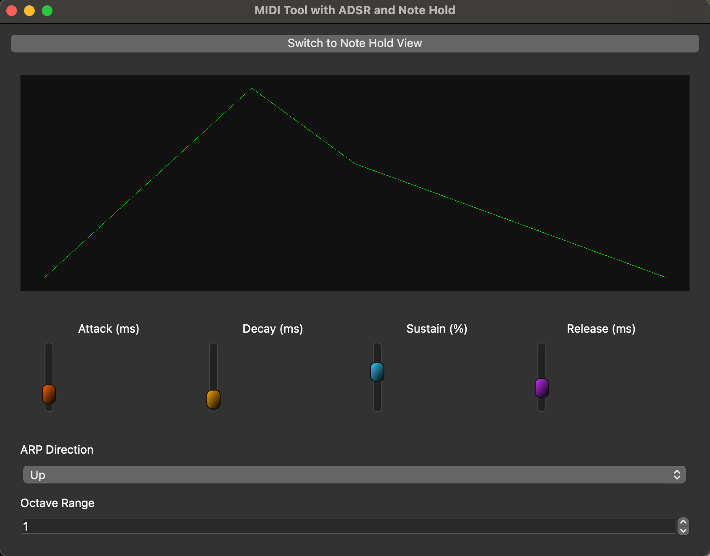
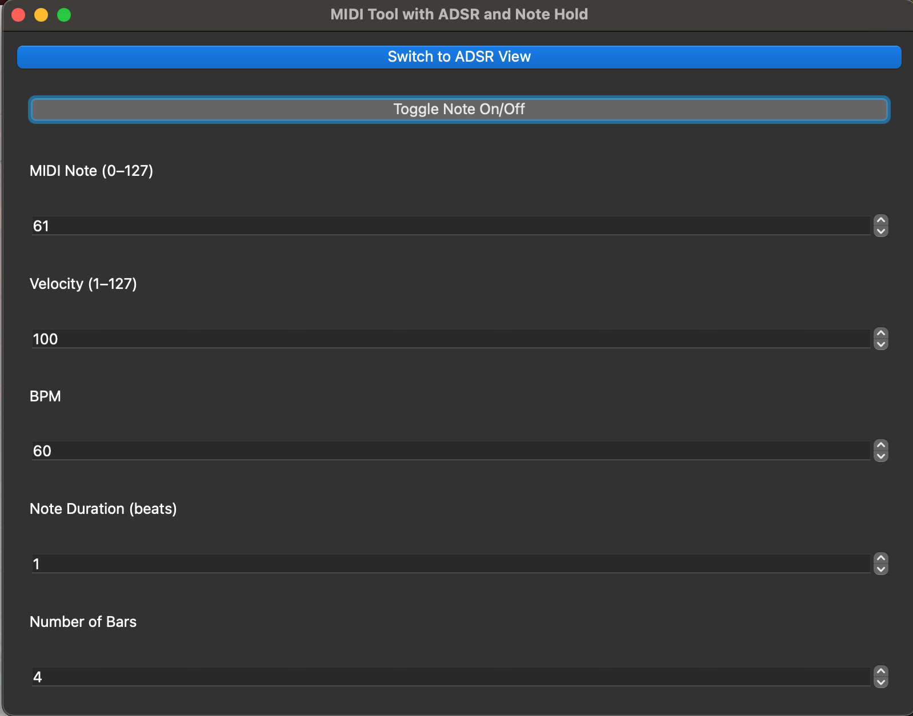

## Prepare repository

Create virtual env

```shell
python3 -m venv ./
source ./bin/activate
```

Install packages

```shell
python3 -m pip install -r requirements.txt
brew install tcl-tk
```

to run

```shell
python3 midi.py
```

## check midi in macos

Thanks — that error likely means:

1. **No available MIDI output ports**, or
2. **`mido.get_output_names()` returned an empty list**, so `mido.get_output_names()[0]` fails.

Let’s troubleshoot it step-by-step on macOS:

---

### ✅ Step 1: Check Available MIDI Output Ports

Run this quick script:

```python
import mido
print(mido.get_output_names())
```

This should return something like:

```python
['IAC Driver Bus 1']
```

If the list is **empty**, then:

- The **IAC Driver** is either not enabled or not online.
- Your system doesn’t expose a MIDI port to Python.

---

### ✅ Step 2: Make Sure IAC Driver Is Enabled

Do this:

1. Open **Audio MIDI Setup** → `⌘ + Space`, search “MIDI”.
2. Open **MIDI Studio** (from the _Window_ menu).
3. Double-click **IAC Driver**.
4. Ensure:
   - **“Device is online”** is checked.
   - At least one port (like “Bus 1”) exists.

Then re-run the script above to confirm the IAC port appears.


## Screenshots




